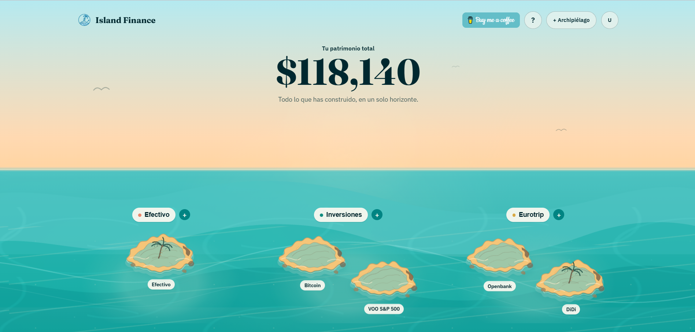
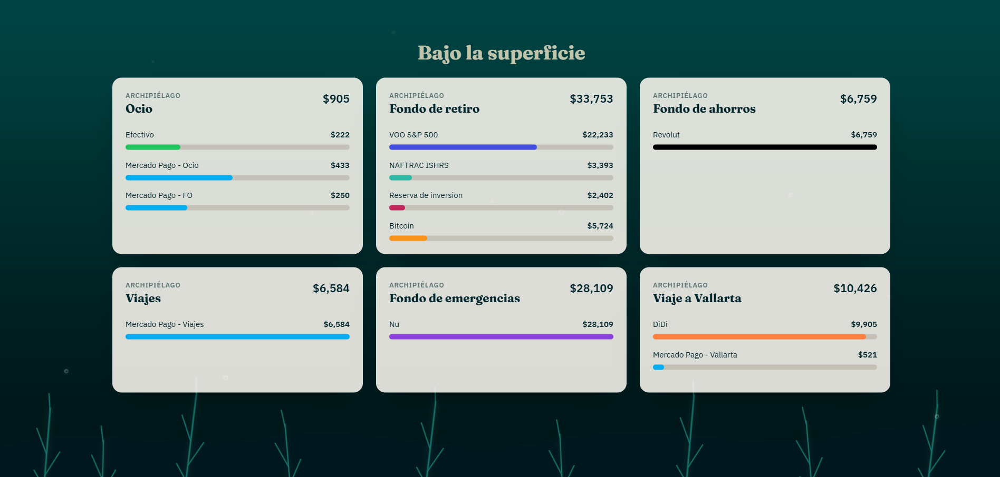
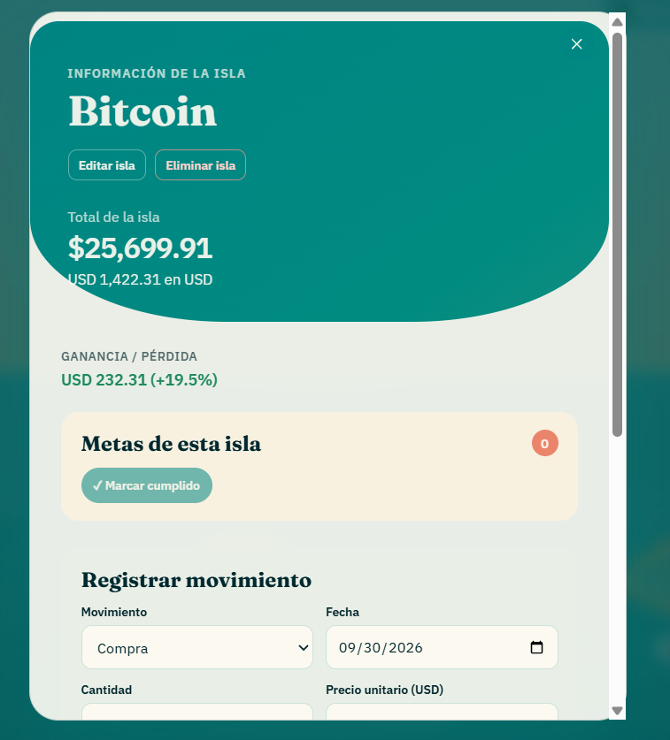
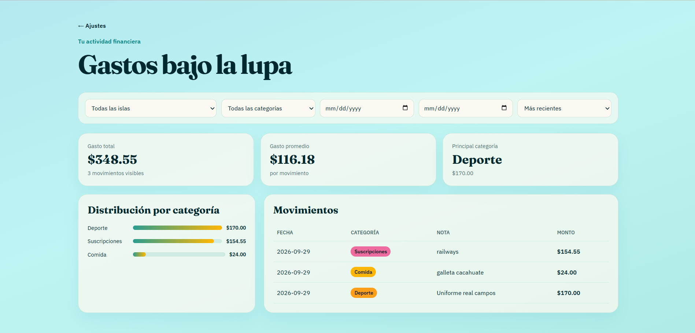

# 🏝️ Island Finance: Frontend

Web client for **Island Finance**, a personal finance app where your money lives on islands: financial modules are archipelagos and each account is an island.

> ⚙️ Backend: [islands-finance-backend](https://github.com/morkmorquecho/islands-finance-backend)
> 🌐 Live app: [islandfinance.cc](https://islandfinance.cc)

This repository is public so you can see how I structure and build a Vue 3 application. It is not meant to be cloned and run.

## Screenshots

### 1. Home: the archipelago concept
The landing view introduces the core idea of the app: your finances are organized as **archipelagos** (financial modules) made of **islands** (individual accounts and assets).



### 2. Beneath the surface
A detailed view that shows exactly how much money each island holds, individually.



### 3. Island detail
Each island has its own page with gains, performance and detailed information about the asset or account.



### 4. Expenses
A dedicated expenses panel to keep track of where your money goes.



## Features

- **Archipelago-themed interface** with animated tropical design elements
- **Per-island breakdown** of balances, gains and details
- **Expenses panel** to track spending
- **Modal-based form system** to create and edit islands and accounts
- **Authentication flow** with JWT, automatic token refresh and request rate limiting
- **Protected routes** with Vue Router navigation guards
- **Centralized state** with Pinia
- **Asset search with autocomplete** backed by live market data
- **Clear handling of unavailable prices** in the UI

## Stack

Vue 3 · Vue Router · Pinia · Axios · Vercel

## Engineering Decisions

**API client generated from the OpenAPI schema.**
The service layer, a Pinia auth store, router guards and the main views were scaffolded from the backend's OpenAPI schema, which keeps the frontend in sync with the API contract instead of hand-writing every request.

**One place for auth and request logic.**
`api.js` centralizes JWT handling, token refresh and rate limiting, so views and stores never deal with expired tokens directly.

**Scoped styles over global CSS.**
The global stylesheet was refactored into scoped component styles, so every component owns its look and the tropical theme stays maintainable as the app grows.

**Reusable modal form system.**
Forms share a single modal-based pattern, which keeps creation and editing flows consistent across islands and accounts.

**Honest UI for missing data.**
When the backend reports a price as unavailable, the interface says so instead of showing misleading values.

## Project Structure
```
src/
├── api/          # API client and generated services
├── stores/       # Pinia stores
├── router/       # Routes and navigation guards
├── views/        # Pages
├── components/   # Reusable components and modals
└── assets/       # Styles and static assets
public/
└── screenshoot/  # README screenshots
```

## Deployment

Deployed on Vercel, connected to the production API at `api.islandfinance.cc`.

## License

© Matias Morquecho. All rights reserved. The code is shown for portfolio purposes and may not be copied or redistributed without permission.
